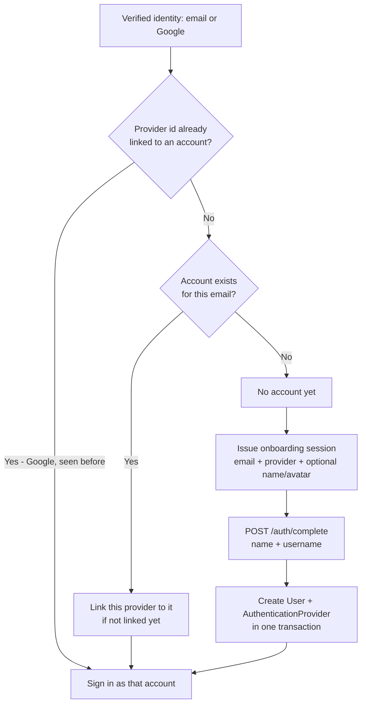
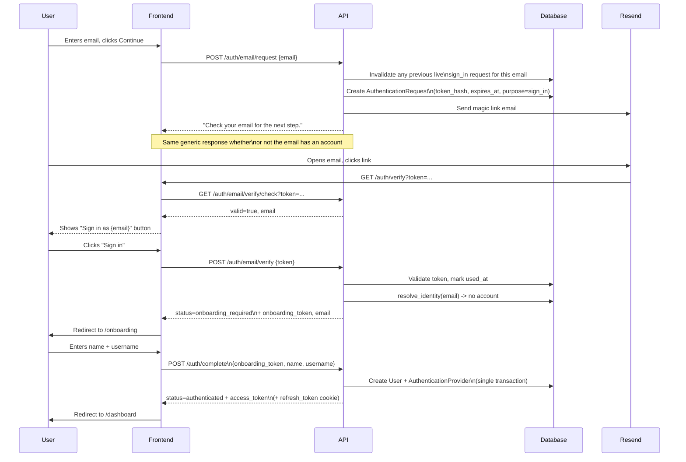
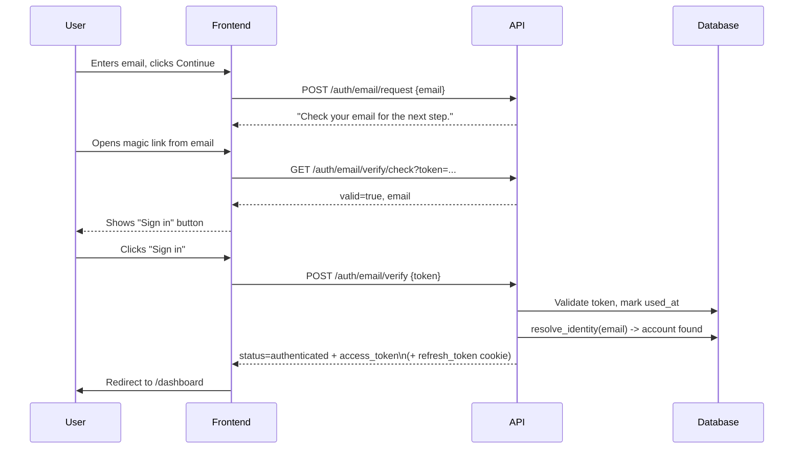
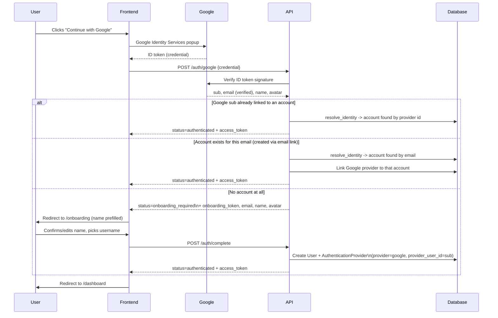
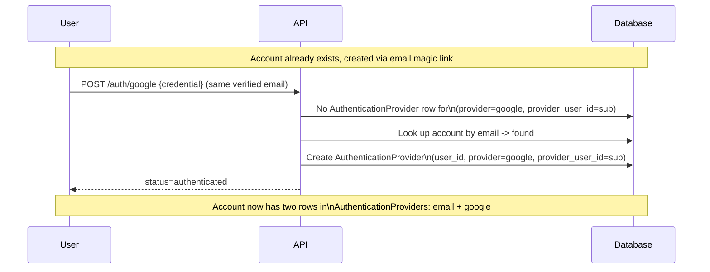
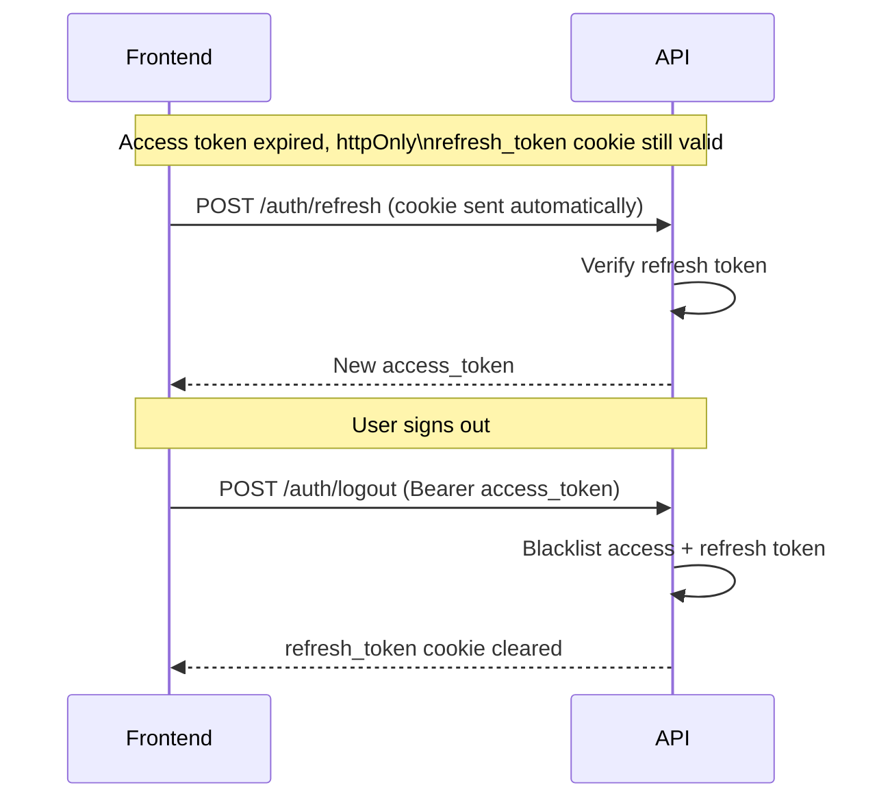
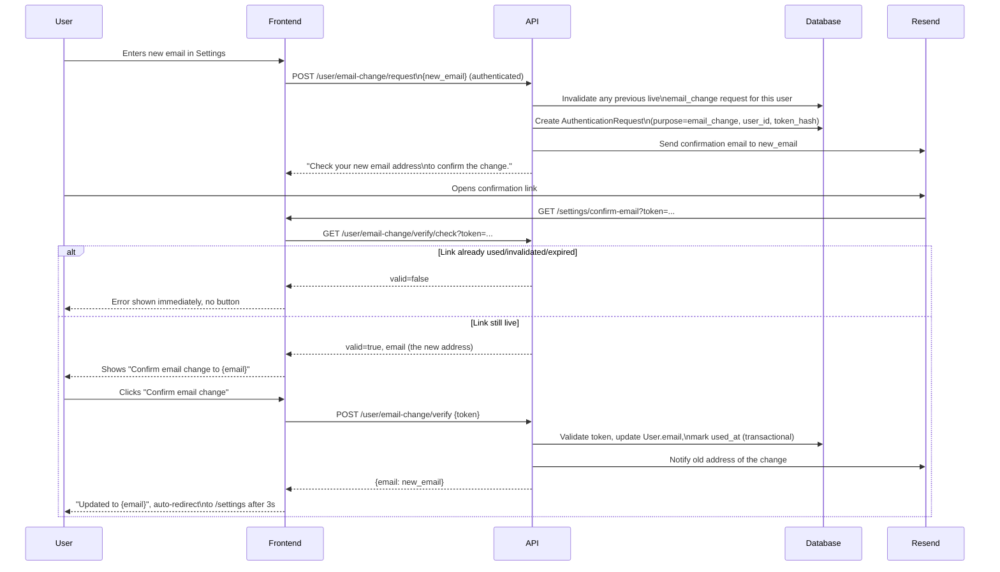

# Open Diving API

Backend API for Open Diving app.

## Authentication

There is a single entry point into the app: email magic link or Google - no
passwords, no separate sign up flow. See `src/app/api/v1/auth.py` for the endpoints
(`/auth/email/request`, `/auth/email/verify`, `/auth/google`, `/auth/complete`) and
`DECISIONS.md` for the full design rationale.

Changing an account's email (`src/app/api/v1/users.py`) reuses the same magic-link
mechanics: `POST /user/email-change/request` emails a confirmation link to the
*new* address, and the change only applies once `POST /user/email-change/verify`
confirms it - see `DECISIONS.md`.

All endpoints below are mounted under `/api/v1` (e.g. `/api/v1/auth/email/request`).

### User journeys

Every journey funnels through the same question, answered once by
`services.auth_service.resolve_identity`: "has this verified identity (an email
address, or - for Google - a stable provider subject id) been seen before?" The
answer decides whether the caller is signed in immediately or sent to onboarding -
there is no other branch point, and no `User` row is ever created outside of
`POST /auth/complete`.



#### 1. Sign up with email (new user)

No separate "register" endpoint - a brand-new email just falls out of the same
`/auth/email/request` → `/auth/email/verify` pair as signing in, because the server
doesn't know yet whether the address belongs to anyone.



#### 2. Sign in with email (existing user)

Identical first step to signing up - the difference only appears once the link is
verified and `resolve_identity` finds a matching account.



#### 3. Sign in / sign up with Google

One endpoint (`POST /auth/google`) covers both a brand-new Google sign-in and one
for an account that already exists (either created via Google before, or via email
and now linking Google for the first time).



#### 4. Linking a second provider to an existing account

No explicit "link account" action exists - linking is a side effect of
`resolve_identity` recognizing the same email under a different provider.



#### 5. Session refresh & logout



#### 6. Changing an account's email

Shares the magic-link mechanics above, but requires an active session to start,
and a precheck on the confirmation page so a stale/already-used link never shows a
clickable button to begin with (see `DECISIONS.md`).



Magic-link emails are sent via [Resend](https://resend.com). Set these in `src/.env`:

```bash
# Required to actually deliver magic-link emails - without it, the link is only
# logged (useful for local development).
RESEND_API_KEY="re_..._your_key"
EMAIL_FROM_ADDRESS="onboarding@resend.dev"

# Used to build the magic-link URL (`{FRONTEND_URL}/auth/verify?token=...`).
FRONTEND_URL="http://localhost:3000"

# Optional - tune magic-link/onboarding-session expiry and rate limits. See
# `MagicLinkSettings`/`CryptSettings` in `src/app/core/config.py` for all of them
# and their defaults.
MAGIC_LINK_TOKEN_EXPIRE_MINUTES=30
ONBOARDING_TOKEN_EXPIRE_MINUTES=30
EMAIL_CHANGE_TOKEN_EXPIRE_MINUTES=30
```

## Endpoints

### Parse a Suunto dive XML file

Upload a Suunto dive XML file and receive the parsed dive data as JSON:

```bash
curl -X POST http://localhost:8000/api/v1/dive/parse-xml \
  -F "file=@Dive_2021-04-06-1231.xml"
```
