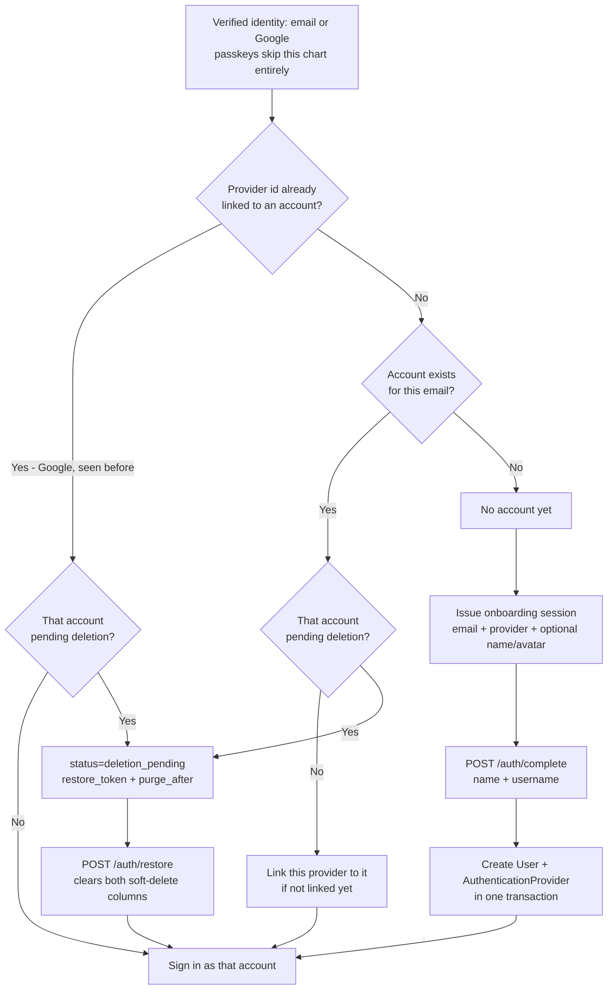
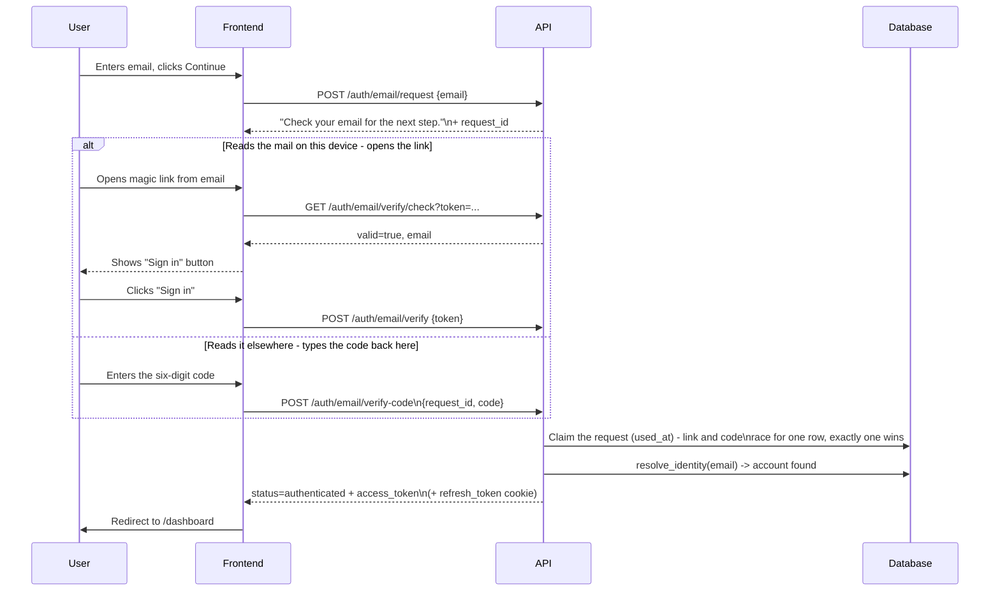
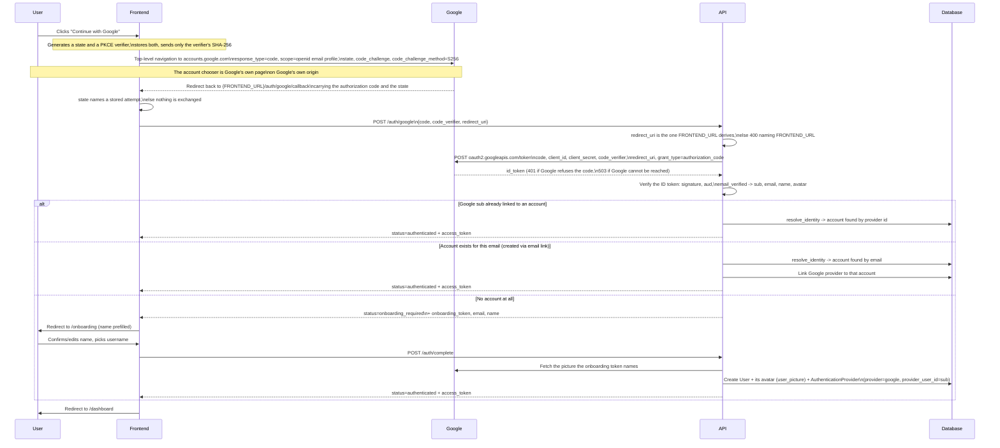
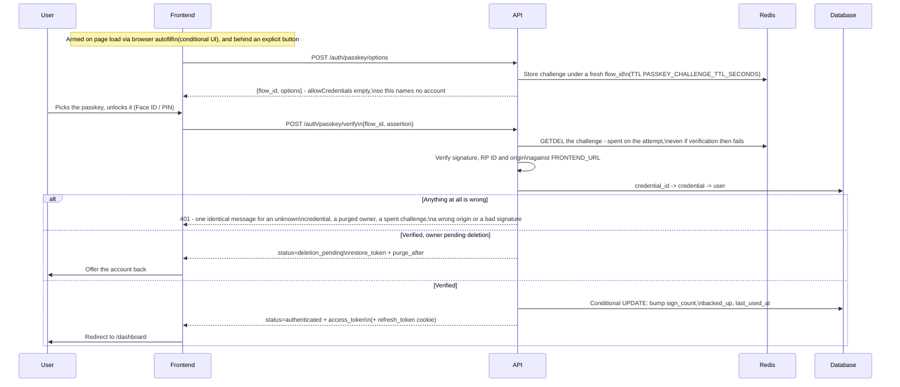
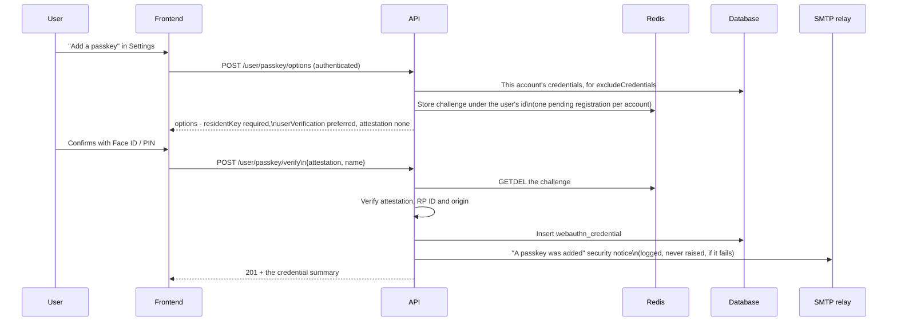
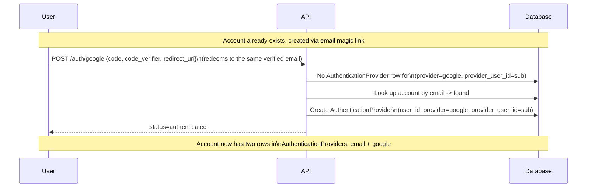
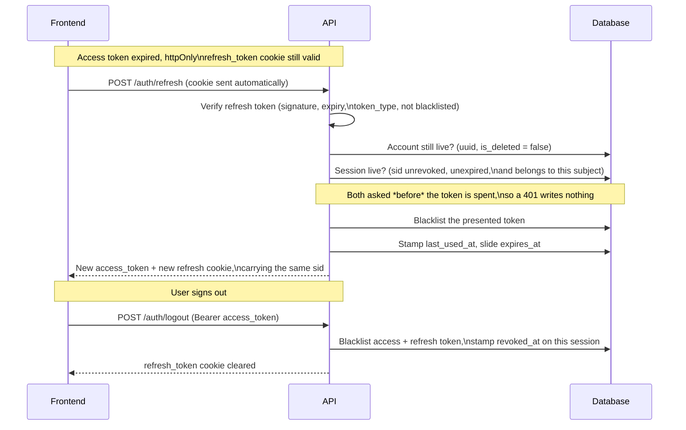
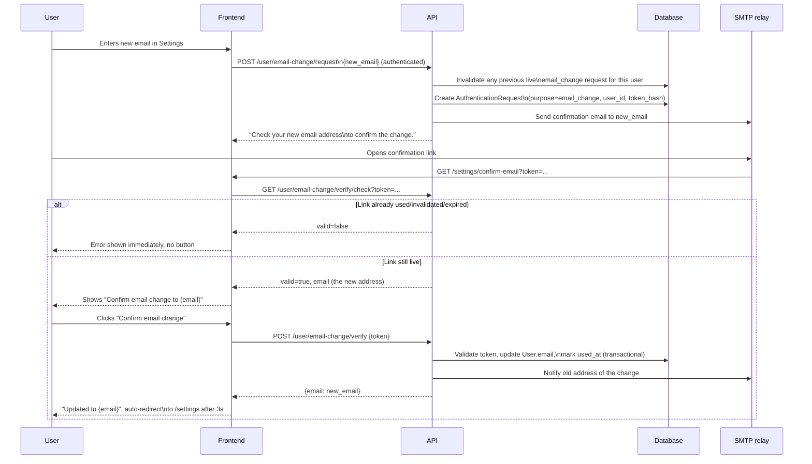
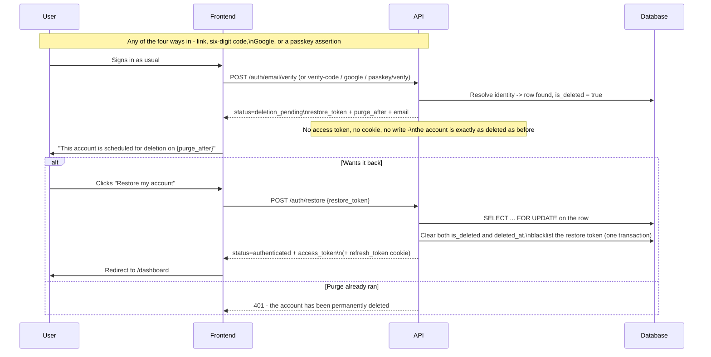

# Authentication

How sign-in, sign-up, account linking, session refresh, and email changes work in the OpenDiving
API.

There is a single entry point into the app: email, Google, or a passkey - no passwords, no separate
sign up flow. See `src/app/api/v1/auth.py` for the endpoints (`/auth/email/request`,
`/auth/email/verify`, `/auth/email/verify-code`, `/auth/google`, `/auth/passkey/options`,
`/auth/passkey/verify`, `/auth/complete`, `/auth/restore`), `src/app/api/v1/passkeys.py` for
managing the passkeys on an account, `src/app/api/v1/sessions.py` for listing and revoking the
devices signed in to one, and `DECISIONS.md` for the full design rationale.

The email path offers **two ways to finish, backed by one record**. `POST /auth/email/request`
emails a magic link *and* a six-digit code, and either completes the sign-in - whichever is used
first consumes the row, so exactly one session is ever issued. The code exists because a link signs
in the device that opens it, and mail is often read on a different one; the code travels with the
person instead. It is redeemed against the `request_id` the request response hands back to the
browser that asked, and is bounded by `SIGN_IN_CODE_ATTEMPTS_MAX` wrong guesses, after which the
code alone dies and the link keeps working.

A **passkey is a third first factor, never a second one** - there is no password here for a second
factor to backstop, and a ceremony with user verification is already two factors in one gesture. It
is the one method that does not go through `resolve_identity`: a credential row names its account
outright, so there is nothing to resolve and no onboarding branch to reach. Registering one needs an
existing session, which is why there is no "sign up with a passkey".

Changing an account's email (`src/app/api/v1/users.py`) reuses the same magic-link mechanics:
`POST /user/email-change/request` emails a confirmation link to the *new* address, and the change
only applies once `POST /user/email-change/verify` confirms it - see `DECISIONS.md`.

All endpoints below are mounted under `/api/v1` (e.g. `/api/v1/auth/email/request`).

### User journeys

Every journey that starts from an email address funnels through the same question, answered once by
`services.auth_service.resolve_identity`: "has this verified identity (an email address, or - for
Google - a stable provider subject id) been seen before?" The answer has **three** outcomes, carried
back as `AuthOutcome.status`: the caller is signed in immediately (`authenticated`), sent to
onboarding (`onboarding_required`), or offered back an account that is inside its deletion grace
period (`deletion_pending`). No `User` row is ever created outside of `POST /auth/complete`.

A passkey assertion is the exception, and the only one: it carries no email to resolve, so it
answers straight to the account that owns the credential and can never reach onboarding. It can
still answer `deletion_pending` - that decision is made at its own resolve site,
`services.passkey_service.finish_sign_in`.



**A `deletion_pending` response is not a session and changes nothing.** No access token is issued,
no cookie is set, and the account stays deleted until the user acts on it - signing in must never
silently cancel a deletion somebody deliberately asked for. A client that does not know the third
status must not fall through to its onboarding branch: there is no `onboarding_token` in it either.

### Registration can be closed, and the onboarding branch is where it shows

`REGISTRATION_MODE` is `invite` by default. On such an instance the "no account yet" branch above is
not automatic: the address has to hold a live `invitation` row, or the account is refused with a
`403` whose `detail` says so.

The refusal happens **twice**, at two points and for two different reasons, and both are in
`services.registration_gate`:

- At the onboarding branch, *for the person's benefit* - so nobody fills in a profile form only to
  be refused at the end. No onboarding token is minted and no `ONBOARDING_STARTED` row is written.
- Inside `POST /auth/complete`'s creating transaction, *authoritatively*. This is the one that
  carries the guarantee: it runs below `release_read_transaction` (which rolls back), so a
  revocation committed between the two is honoured, and "account created" and "invitation accepted"
  are a single commit.

Neither is an enumeration oracle. Both run only after the caller has proven the address, so the
`403` tells them nothing about an address that is not theirs - and `POST /auth/email/request` stays
ignorant of invitations entirely, exactly as it stays ignorant of accounts.

**The first account on an empty instance is exempt in both modes**, and is created with
`is_superuser = true`. That is what makes "the first account to sign in is yours" literally true,
and it is what stops a closed-by-default instance being a first-run deadlock. It is a property of
the `user` table being empty rather than a one-shot flag, so an instance whose last account is
purged hands the next signer-in the same deal.

**The passkey paths need nothing**: a credential exists only because a signed-in user registered it,
so they cannot reach the onboarding branch at all. The Google path needs nothing beyond
normalisation - its verified address reaches the same funnel, lowercased at the gate.

An address asks to be let in through `POST /invite-requests`, which is anonymous, answers the same
`202` for every address and never queries the `user` table. The operator works that queue through
`GET /admin/invite-requests` and `POST /admin/invitations`; a member invites from their own
settings, bounded by `INVITATIONS_PER_USER` per `INVITATIONS_WINDOW_DAYS`. In `open` mode the
user-facing invitation routes answer `404` and the feature is absent rather than idle.

#### 1. Sign up with email (new user)

No separate "register" endpoint - a brand-new email just falls out of the same `/auth/email/request`
→ `/auth/email/verify` pair as signing in, because the server doesn't know yet whether the address
belongs to anyone. The code from the same email reaches the same place: it returns
`onboarding_required` too, so the unified flow needs no carve-out for it.

```mermaid
sequenceDiagram
    participant U as User
    participant FE as Frontend
    participant API as API
    participant DB as Database
    participant Mail as SMTP relay

    U->>FE: Enters email, clicks Continue
    FE->>API: POST /auth/email/request {email}
    API->>DB: Invalidate any previous live\nsign_in request for this email
    API->>DB: Create AuthenticationRequest\n(token_hash, code_hash, expires_at, purpose=sign_in)
    API->>Mail: Send email carrying the link\nand the six-digit code
    API-->>FE: "Check your email for the next step."\n+ request_id
    Note over API,FE: Same generic message whether or not\nthe email has an account; request_id is\na fresh uuid either way

    alt Reads the mail on this device - opens the link
        U->>Mail: Opens email, clicks link
        Mail->>FE: GET /auth/verify?token=...
        FE->>API: GET /auth/email/verify/check?token=...
        API-->>FE: valid=true, email
        FE-->>U: Shows "Sign in as {email}" button

        U->>FE: Clicks "Sign in"
        FE->>API: POST /auth/email/verify {token}
    else Reads it elsewhere - types the code back here
        U->>FE: Enters the six-digit code
        FE->>API: POST /auth/email/verify-code\n{request_id, code}
        API->>DB: Compare code_hash; a wrong guess\nincrements code_attempts
    end
    API->>DB: Claim the request (used_at) - link and code\nrace for one row, exactly one wins
    API->>DB: resolve_identity(email) -> no account
    API-->>FE: status=onboarding_required\n+ onboarding_token, email
    FE->>U: Redirect to /onboarding

    U->>FE: Enters name + username
    FE->>API: POST /auth/complete\n{onboarding_token, name, username}
    API->>DB: Create User + AuthenticationProvider\n(single transaction)
    API-->>FE: status=authenticated + access_token\n(+ refresh_token cookie)
    FE->>U: Redirect to /dashboard
```

#### 2. Sign in with email (existing user)

Identical first step to signing up - the difference only appears once the link or code is verified
and `resolve_identity` finds a matching account.



#### 3. Sign in / sign up with Google

One endpoint (`POST /auth/google`) covers both a brand-new Google sign-in and one for an account
that already exists (either created via Google before, or via email and now linking Google for the
first time).

This is the OAuth 2.0 authorization code flow with PKCE, built by hand. **No code of Google's runs
in the visitor's browser at any point**, and nothing reaches Google until the button is pressed: the
web app composes an authorization URL itself and performs a top-level navigation to it. What comes
back through the browser is a single-use authorization code, which is worthless to anyone who
intercepts it — redeeming it takes `GOOGLE_CLIENT_SECRET`, which never leaves this server, and the
PKCE verifier, which never leaves the browser that generated it. The ID token identifying the diver
travels only between Google and this API.



**No `nonce`, deliberately.** A nonce binds an ID token to the request that asked for it, and the
replay it defends against is of a token that travelled through the browser — the implicit flow. Here
the ID token never touches the browser: it arrives over TLS straight from Google's token endpoint,
in exchange for a single-use code that cannot be redeemed without both the client secret and the
PKCE verifier. Google enforces the parameter for `response_type=id_token` and not for
`response_type=code`, exactly as OpenID Connect Core specifies (§3.1.2.1 makes it optional for this
flow, §3.2.2.1 required for the implicit one). Google's own OpenID Connect page marks it
"(Required)" in a parameter table that serves both flows at once, which is where the apparent
contradiction comes from; the flow-specific
[OAuth 2.0 for Web Server Applications](https://developers.google.com/identity/protocols/oauth2/web-server)
page lists it among the required parameters of neither.

**PKCE support is real but undocumented in Google's guides.** What establishes it is the OpenID
discovery document at <https://accounts.google.com/.well-known/openid-configuration>, which
advertises `"code_challenge_methods_supported": ["plain", "S256"]`. Cite that rather than a guide.

#### 4. Sign in with a passkey

Two round trips and no email address anywhere. Discoverable credentials mean the ceremony never asks
who the user is: the assertion carries the credential id, and the credential row names the account -
so there is no email-first step for a "does this address have a passkey" oracle to hide in.



The `deletion_pending` branch is the one outcome that is *not* the uniform 401, and it sits
**after** signature verification for that reason: every other failure is reachable by someone
holding no credential, while a caller who has just produced a valid assertion is not. Placed any
earlier it would be a credential-existence oracle. It also returns before the counter is recorded,
so reaching the offer writes nothing.

A counter that has gone *backwards* (stored > 0, presented ≤ stored) is the cloned-authenticator
signal: the assertion is refused and a `WARNING` is logged. A synced passkey reports `0` forever,
and `0 → 0` is not a regression.

#### 5. Registering a passkey

Only ever from inside a session, which is what makes auto-linking a non-question - the credential is
born attached to the account that made it.



409 when the account is already at `PASSKEY_MAX_CREDENTIALS_PER_USER`, or when that credential is
already registered. Revoking one (`DELETE /user/passkey/{uuid}`) is a real delete and sends the
matching notice; an account may remove its last passkey, since the email path is always there.

#### 6. Linking a second provider to an existing account

No explicit "link account" action exists - linking is a side effect of `resolve_identity`
recognizing the same email under a different provider.



#### 7. Session refresh & logout

Refresh **rotates**: the presented cookie is spent and an unrelated replacement is minted, so a
leaked cookie has a much shorter useful life than the `REFRESH_TOKEN_EXPIRE_DAYS` window. What
survives that rotation is the `sid` claim, which names the `user_session` row rather than the
issuance — see *Sessions* below for the row and what checks it.



Every way that exchange can fail answers the same 401 with the same body — a revoked session, an
expired one, another account's, a deleted account and unparseable garbage are deliberately
indistinguishable, so the endpoint is never an oracle for whether a given cookie was ever real.

**Presenting a cookie that was already spent ends the session it belongs to.** Rotation makes the
replayed value itself worthless, but not the pair minted from it — which, when the replay is a theft
rather than an accident, is the pair somebody else is holding. Both halves carry the same `sid`, so
stamping `revoked_at` on that row ends them together: the cookie at its next rotation and the access
token on its very next request. Whoever holds either one signs in again and gets a new session.

That fires only past the five-second line the audit event already used, because the same branch is
where rotation's documented two-tab race lands — two tabs refreshing at the same instant, the loser
presenting a cookie the winner has just spent, milliseconds apart. Inside that window nothing is
revoked, since the only person who would be signed out is the diver whose own tabs collided. The
`WARNING` is not conditioned either way.

#### 8. Changing an account's email

Shares the magic-link mechanics above, but requires an active session to start, and a precheck on
the confirmation page so a stale/already-used link never shows a clickable button to begin with (see
`DECISIONS.md`).



#### 9. Restoring an account inside the deletion grace period

`DELETE /user` flags the account and names a purge date `ACCOUNT_DELETION_GRACE_DAYS` out; the app
goes dark immediately and every read 401s from that instant. Until the purge runs, signing in by any
of the four routes reaches the offer below rather than a dead end - but it is only an *offer*, and
the account stays deleted until `POST /auth/restore` is called.



On the magic-link path only, `GET /auth/email/verify/check` answers `valid=true` **plus**
`deletion_pending` and `purge_after`, so the landing page can label the button *Restore my account*
rather than *Sign in* before anything is spent. The other three have no side-effect-free precheck -
a typed code, a round trip out to Google and a biometric gesture are all commitments - so they show
the same outcome on a screen after the POST. Note the asymmetry that follows:
`POST /auth/email/verify-code` claims the request before resolving, so a code spent on reaching the
offer is spent, while the link's token is untouched by the precheck and stays reopenable until it
expires.

The restore token is its own `TokenType`, is single-use, and expires with
`ONBOARDING_TOKEN_EXPIRE_MINUTES`. It is never emailed: the deletion confirmation tells the user to
sign in, because a restore link sitting in an inbox for a fortnight would be a standing key to an
account its owner asked to have destroyed. See `DECISIONS.md` for the full reasoning, including how
the row lock settles the race with the purge job.

### Sessions

Every sign-in, account creation and restore writes a `user_session` row, and both tokens in the pair
carry its public uuid as a `sid` claim. That claim is what makes a session a thing you can see and
end:

- `GET /user/sessions` - the caller's live sessions, most recently used first. Each row carries when
  it was created, when it was last used, the IP it was seen from, the raw `User-Agent` string, and
  `current` for the one the request itself was made with.
- `DELETE /user/session/{uuid}` - sign one other device out. Someone else's uuid is a 404, exactly
  as for one that does not exist; **the caller's own session is a 409**, because ending your own
  session is what `POST /auth/logout` is - it also has to clear the cookie and blacklist the
  presented pair.
- `DELETE /user/sessions` - sign every *other* device out, and report how many that was.

Three things are worth knowing about what a revoke does.

**It ends the access token as well as the refresh.** A revoked row cannot rotate anything, and
`get_current_user` asks the same live-or-not question of the presented token's `sid` on every
authenticated request - so the revoked device is refused on its very next call, not at its next
`/auth/refresh`. It used to be only the refresh, which left the device working with the access token
it already held for up to `ACCESS_TOKEN_EXPIRE_MINUTES` - and that window is precisely the one this
button exists for, since the case it is pressed for is a laptop that has just gone missing.

**`expires_at` is an inactivity window, not a session length.** Each refresh stamps `last_used_at`
and slides the expiry out by `REFRESH_TOKEN_EXPIRE_DAYS`, so a browser in daily use never expires
and one left alone for that long does. Changing the setting changes both.

**Live sessions are capped at 100 per account**, and creating one past the cap revokes the
least-recently-used row - by `last_used_at`, never by creation order, so a browser in daily use is
never signed out to make room for a dormant one.

`sid` does **not** replace `jti`. The `jti` identifies one issuance and is what makes blacklisting a
token by value a per-issuance revocation; `sid` identifies the device and is carried unchanged
across every rotation. That is also what a replayed refresh token is now revoked *by*: past the
replay threshold the session the spent token names is stamped, which ends the pair rotated out of it
as well - see *Session refresh & logout* above.

**Upgrading signs everyone out once.** Neither half of a pair minted before this feature carries a
`sid`, and both halves are now refused for want of one - the access token on its next request, the
refresh cookie on its next rotation. So the diver signs in again, once. There is no compatibility
shim, and nothing else about the account is affected.

### The auth audit trail

Auth events are recorded in `auth_audit_event`: sign-ins with their provider, account creation and
restore, provider links, passkeys added and removed, email changes, deletion requests, logouts,
session revocations, and the two failures the app considers rare and meaningful - a replayed refresh
token and a regressed passkey signature counter.

A row carries when, where (the request's IP and `User-Agent`) and who - an account id where the
request had already established one, and an email address for the genuinely pre-account events (an
auth request created, a sign-in code failed, onboarding started, an invitation requested). It
**never** carries a token, a token hash, a sign-in code or its digest.

Nothing in the API returns these rows; they are visible to an operator through the admin panel at
`/admin`, registered read-only. Retention is fixed rather than configurable: 90 days for events tied
to an account, and 7 days for the user-less ones - the same window an `authentication_request` row
already gets, since those are the rows that name an address belonging to somebody who may never have
signed up. Deleting an account erases its events with it, on both arms: the account-tied rows follow
the foreign key, and the user-less ones are deleted by email.

**One thing to get right in your deployment.** The `ip` on both tables is whatever `client_ip`
resolves, so an instance behind a reverse proxy that has not set `TRUSTED_PROXY_IPS` records the
*proxy's* address on every row - the same misconfiguration the install bundle's `example.env`
already warns about for rate limiting, with the same fix.

Sign-in emails go out over SMTP - any relay works, and any provider will give you one. Set these in
`src/.env`:

```bash
# Required to actually deliver sign-in emails - without SMTP_HOST, the link and code
# are only logged (useful for local development). Resend users: smtp.resend.com,
# username "resend", password = the API key.
SMTP_HOST="smtp.example.com"
SMTP_PORT=587
SMTP_TLS_MODE="starttls"   # starttls (587) | tls (465) | none (a local relay only)
SMTP_USERNAME="..."        # both optional: an anonymous relay needs neither
SMTP_PASSWORD="..."
# Required as soon as SMTP_HOST is set - startup fails without it, since there is no
# address that is deliverable through an arbitrary relay by default.
EMAIL_FROM_ADDRESS="noreply@yourdomain.example"

# Used to build the magic-link URL (`{FRONTEND_URL}/auth/verify?token=...`), and - since
# the relying-party id and expected origin are derived from it - this *is* the passkey
# domain. Changing its hostname orphans every passkey already registered; the email path
# is the recovery. Browsers only expose WebAuthn in a secure context, so a plain-HTTP
# instance gets no passkeys and the UI hides itself (`localhost` is exempt; a bare IP
# address is never a valid relying-party id, certificate or not).
FRONTEND_URL="http://localhost:3000"

# Optional - tune magic-link/onboarding-session expiry and rate limits. See
# `MagicLinkSettings`/`CryptSettings` in `src/app/core/config.py` for all of them
# and their defaults.
MAGIC_LINK_TOKEN_EXPIRE_MINUTES=30
ONBOARDING_TOKEN_EXPIRE_MINUTES=30
EMAIL_CHANGE_TOKEN_EXPIRE_MINUTES=30

# Wrong guesses allowed against the six-digit code before it is spent. The link in
# the same email is untouched by this - see `DECISIONS.md` for why that asymmetry
# is the point.
SIGN_IN_CODE_ATTEMPTS_MAX=5

# Optional, and there is deliberately no on/off switch for passkeys - the browser's own
# capability detection is the switch. Challenges live in Redis and, unlike rate limiting,
# fail *closed*: with Redis down the passkey routes answer 503 while email sign-in, being
# pure Postgres, keeps working.
PASSKEY_CHALLENGE_TTL_SECONDS=600
PASSKEY_MAX_CREDENTIALS_PER_USER=10
```
