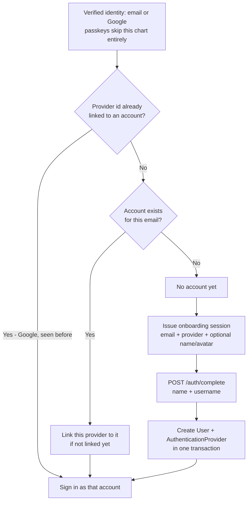
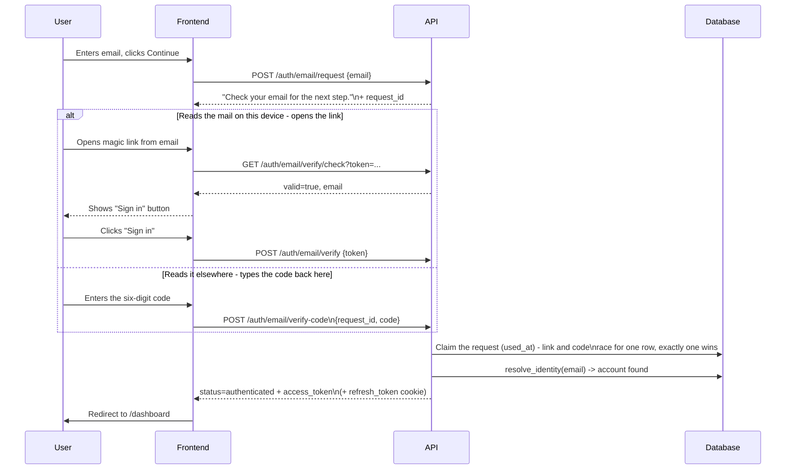
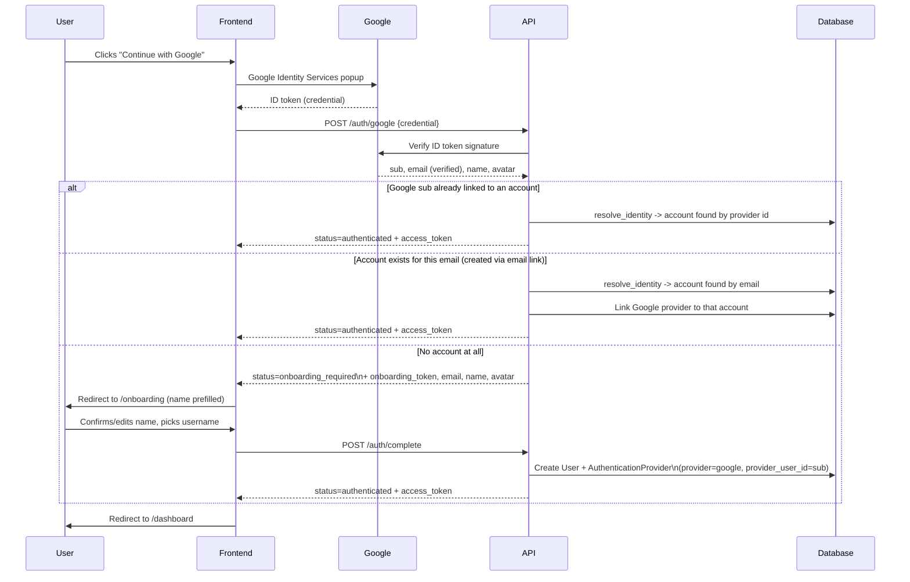
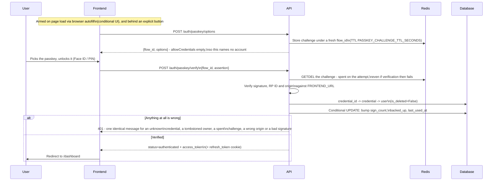
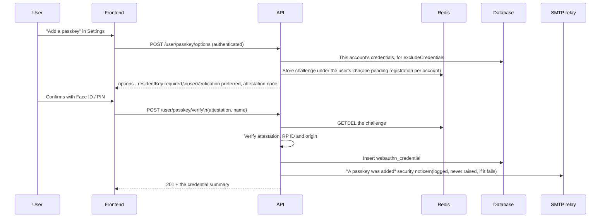
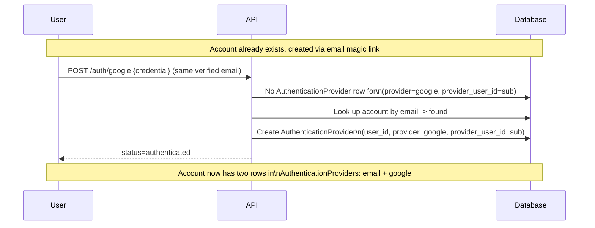
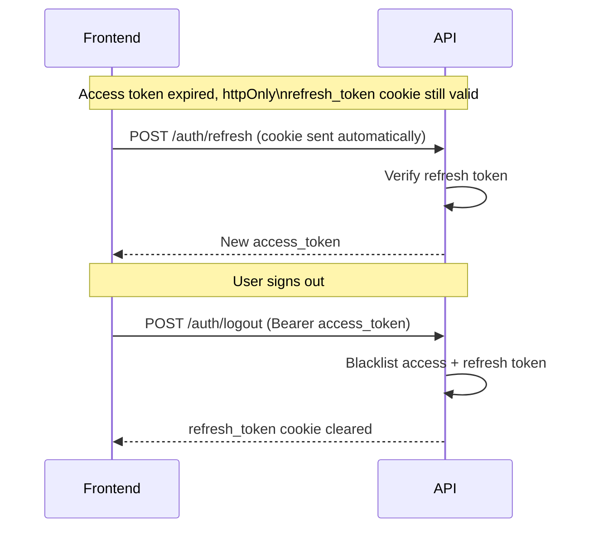
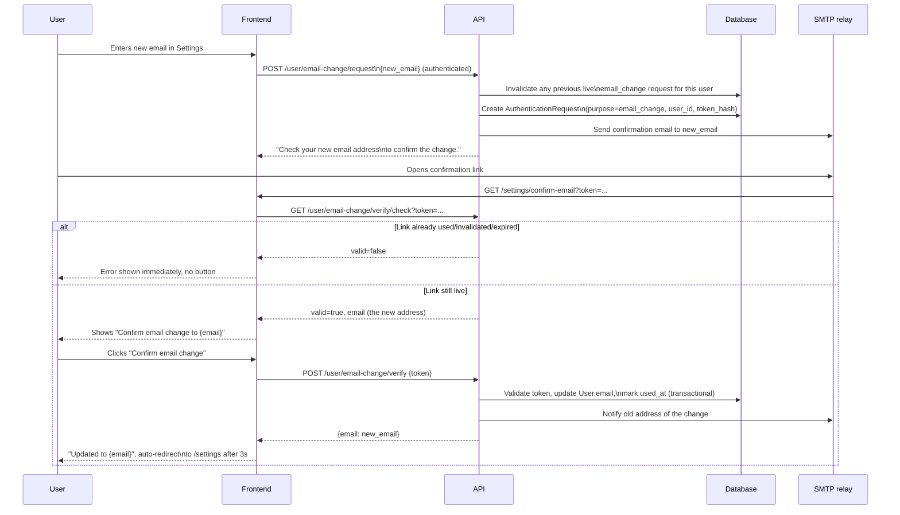

# Authentication

How sign-in, sign-up, account linking, session refresh, and email changes work in the OpenDiving
API.

There is a single entry point into the app: email, Google, or a passkey - no passwords, no separate
sign up flow. See `src/app/api/v1/auth.py` for the endpoints (`/auth/email/request`,
`/auth/email/verify`, `/auth/email/verify-code`, `/auth/google`, `/auth/passkey/options`,
`/auth/passkey/verify`, `/auth/complete`), `src/app/api/v1/passkeys.py` for managing the passkeys on
an account, and `DECISIONS.md` for the full design rationale.

The email path offers **two ways to finish, backed by one record**. `POST /auth/email/request`
emails a magic link *and* a six-digit code, and either completes the sign-in - whichever is used
first consumes the row, so exactly one session is ever issued. The code exists because a link signs
in the device that opens it, and mail is often read on a different one; the code travels with the
person instead. It is redeemed against the `request_id` the request response hands back to the
browser that asked, and is bounded by `SIGN_IN_CODE_ATTEMPTS_MAX` wrong guesses, after which the
code alone dies and the link keeps working.

A **passkey is a third first factor, never a second one** - there is no password here for a second
factor to backstop, and a ceremony with user verification is already two factors in one gesture. It
is the one method that does not go through `resolve_identity`: a credential row names its account
outright, so there is nothing to resolve and no onboarding branch to reach. Registering one needs an
existing session, which is why there is no "sign up with a passkey".

Changing an account's email (`src/app/api/v1/users.py`) reuses the same magic-link mechanics:
`POST /user/email-change/request` emails a confirmation link to the *new* address, and the change
only applies once `POST /user/email-change/verify` confirms it - see `DECISIONS.md`.

All endpoints below are mounted under `/api/v1` (e.g. `/api/v1/auth/email/request`).

### User journeys

Every journey that starts from an email address funnels through the same question, answered once by
`services.auth_service.resolve_identity`: "has this verified identity (an email address, or - for
Google - a stable provider subject id) been seen before?" The answer decides whether the caller is
signed in immediately or sent to onboarding, and no `User` row is ever created outside of
`POST /auth/complete`.

A passkey assertion is the exception, and the only one: it carries no email to resolve, so it
answers straight to the account that owns the credential and can never reach onboarding.



#### 1. Sign up with email (new user)

No separate "register" endpoint - a brand-new email just falls out of the same `/auth/email/request`
→ `/auth/email/verify` pair as signing in, because the server doesn't know yet whether the address
belongs to anyone. The code from the same email reaches the same place: it returns
`onboarding_required` too, so the unified flow needs no carve-out for it.

```mermaid
sequenceDiagram
    participant U as User
    participant FE as Frontend
    participant API as API
    participant DB as Database
    participant Mail as SMTP relay

    U->>FE: Enters email, clicks Continue
    FE->>API: POST /auth/email/request {email}
    API->>DB: Invalidate any previous live\nsign_in request for this email
    API->>DB: Create AuthenticationRequest\n(token_hash, code_hash, expires_at, purpose=sign_in)
    API->>Mail: Send email carrying the link\nand the six-digit code
    API-->>FE: "Check your email for the next step."\n+ request_id
    Note over API,FE: Same generic message whether or not\nthe email has an account; request_id is\na fresh uuid either way

    alt Reads the mail on this device - opens the link
        U->>Mail: Opens email, clicks link
        Mail->>FE: GET /auth/verify?token=...
        FE->>API: GET /auth/email/verify/check?token=...
        API-->>FE: valid=true, email
        FE-->>U: Shows "Sign in as {email}" button

        U->>FE: Clicks "Sign in"
        FE->>API: POST /auth/email/verify {token}
    else Reads it elsewhere - types the code back here
        U->>FE: Enters the six-digit code
        FE->>API: POST /auth/email/verify-code\n{request_id, code}
        API->>DB: Compare code_hash; a wrong guess\nincrements code_attempts
    end
    API->>DB: Claim the request (used_at) - link and code\nrace for one row, exactly one wins
    API->>DB: resolve_identity(email) -> no account
    API-->>FE: status=onboarding_required\n+ onboarding_token, email
    FE->>U: Redirect to /onboarding

    U->>FE: Enters name + username
    FE->>API: POST /auth/complete\n{onboarding_token, name, username}
    API->>DB: Create User + AuthenticationProvider\n(single transaction)
    API-->>FE: status=authenticated + access_token\n(+ refresh_token cookie)
    FE->>U: Redirect to /dashboard
```

#### 2. Sign in with email (existing user)

Identical first step to signing up - the difference only appears once the link or code is verified
and `resolve_identity` finds a matching account.



#### 3. Sign in / sign up with Google

One endpoint (`POST /auth/google`) covers both a brand-new Google sign-in and one for an account
that already exists (either created via Google before, or via email and now linking Google for the
first time).



#### 4. Sign in with a passkey

Two round trips and no email address anywhere. Discoverable credentials mean the ceremony never asks
who the user is: the assertion carries the credential id, and the credential row names the account -
so there is no email-first step for a "does this address have a passkey" oracle to hide in.



A counter that has gone *backwards* (stored > 0, presented ≤ stored) is the cloned-authenticator
signal: the assertion is refused and a `WARNING` is logged. A synced passkey reports `0` forever,
and `0 → 0` is not a regression.

#### 5. Registering a passkey

Only ever from inside a session, which is what makes auto-linking a non-question - the credential is
born attached to the account that made it.



409 when the account is already at `PASSKEY_MAX_CREDENTIALS_PER_USER`, or when that credential is
already registered. Revoking one (`DELETE /user/passkey/{uuid}`) is a real delete and sends the
matching notice; an account may remove its last passkey, since the email path is always there.

#### 6. Linking a second provider to an existing account

No explicit "link account" action exists - linking is a side effect of `resolve_identity`
recognizing the same email under a different provider.



#### 7. Session refresh & logout



#### 8. Changing an account's email

Shares the magic-link mechanics above, but requires an active session to start, and a precheck on
the confirmation page so a stale/already-used link never shows a clickable button to begin with (see
`DECISIONS.md`).



Sign-in emails go out over SMTP - any relay works, and any provider will give you one. Set these in
`src/.env`:

```bash
# Required to actually deliver sign-in emails - without SMTP_HOST, the link and code
# are only logged (useful for local development). Resend users: smtp.resend.com,
# username "resend", password = the API key.
SMTP_HOST="smtp.example.com"
SMTP_PORT=587
SMTP_TLS_MODE="starttls"   # starttls (587) | tls (465) | none (a local relay only)
SMTP_USERNAME="..."        # both optional: an anonymous relay needs neither
SMTP_PASSWORD="..."
# Required as soon as SMTP_HOST is set - startup fails without it, since there is no
# address that is deliverable through an arbitrary relay by default.
EMAIL_FROM_ADDRESS="noreply@yourdomain.example"

# Used to build the magic-link URL (`{FRONTEND_URL}/auth/verify?token=...`), and - since
# the relying-party id and expected origin are derived from it - this *is* the passkey
# domain. Changing its hostname orphans every passkey already registered; the email path
# is the recovery. Browsers only expose WebAuthn in a secure context, so a plain-HTTP
# instance gets no passkeys and the UI hides itself (`localhost` is exempt; a bare IP
# address is never a valid relying-party id, certificate or not).
FRONTEND_URL="http://localhost:3000"

# Optional - tune magic-link/onboarding-session expiry and rate limits. See
# `MagicLinkSettings`/`CryptSettings` in `src/app/core/config.py` for all of them
# and their defaults.
MAGIC_LINK_TOKEN_EXPIRE_MINUTES=30
ONBOARDING_TOKEN_EXPIRE_MINUTES=30
EMAIL_CHANGE_TOKEN_EXPIRE_MINUTES=30

# Wrong guesses allowed against the six-digit code before it is spent. The link in
# the same email is untouched by this - see `DECISIONS.md` for why that asymmetry
# is the point.
SIGN_IN_CODE_ATTEMPTS_MAX=5

# Optional, and there is deliberately no on/off switch for passkeys - the browser's own
# capability detection is the switch. Challenges live in Redis and, unlike rate limiting,
# fail *closed*: with Redis down the passkey routes answer 503 while email sign-in, being
# pure Postgres, keeps working.
PASSKEY_CHALLENGE_TTL_SECONDS=600
PASSKEY_MAX_CREDENTIALS_PER_USER=10
```
